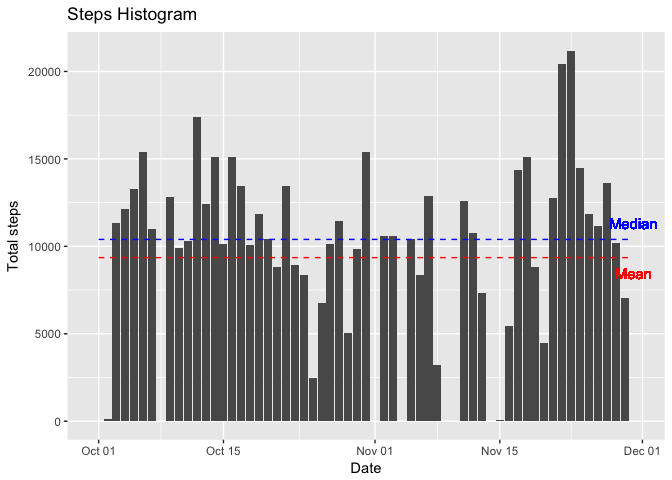
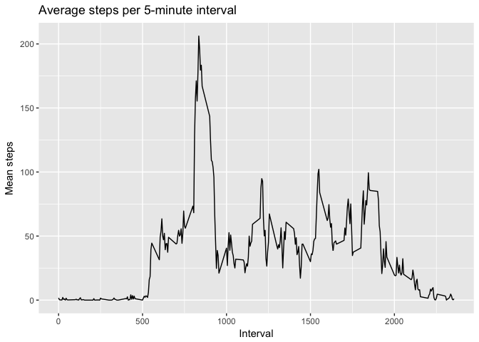
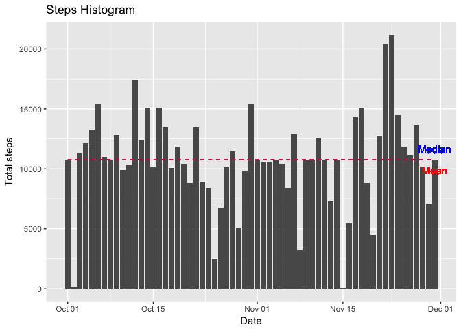
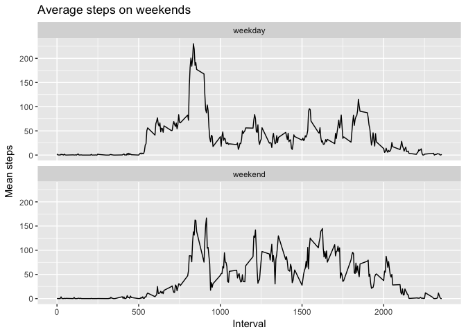

# Reproducible Research: Peer Assessment 1

```r
library(tidyverse)
```

## Loading and preprocessing the data


```r
unzip("activity.zip")
activity_df <- read_csv("activity.csv")
```

## What is mean total number of steps taken per day?

```r
steps_by_day <- activity_df %>% 
  group_by(date) %>% 
  summarise(steps = sum(steps, na.rm = TRUE))

steps_by_day %>% 
  ggplot(aes(x=date, y=steps)) +
  geom_bar(stat = "identity") +
  
  geom_line(aes(y = median(steps)), color = 'blue', linetype = 2, show.legend = FALSE) +
  geom_text(aes(x = max(date), y = median(steps)), color = 'blue', label = "Median", vjust = -1) +

  geom_line(aes(y = mean(steps)), color = 'red', linetype = 2, show.legend = FALSE) +
  geom_text(aes(x = max(date), y = mean(steps)), color = 'red', label = "Mean", vjust = 2) +
  
  labs(title = "Steps Histogram", x = "Date", y = "Total steps")
```

<!-- -->

```r
# Median steps
median(steps_by_day$steps)
```

```
## [1] 10395
```

```r
# Mean steps
mean(steps_by_day$steps)
```

```
## [1] 9354.23
```

## What is the average daily activity pattern?


```r
average_activity <- activity_df %>% 
  group_by(interval) %>% 
  summarise(mean.steps = mean(steps, na.rm = TRUE))

average_activity %>% 
  ggplot(aes(x = interval, y = mean.steps)) +
  geom_line() +
  labs(title = "Average steps per 5-minute interval", x = "Interval", y = "Mean steps")
```

<!-- -->

Interval with max steps (minutes from midnight)

```r
average_activity[which.max(average_activity$mean.steps),]$interval
```

```
## [1] 835
```

## Imputing missing values

Filled NAs with average steps for that interval

```r
# Total NAs
sum(is.na(activity_df$steps))
```

```
## [1] 2304
```

```r
averaged_nas_df <- activity_df %>% 
  mutate(steps =
         ifelse(is.na(.$steps), 
                filter(average_activity, interval == interval)$mean.steps, 
                steps)
         )
```

Histogram of steps per day, filling NAs

```r
filled_steps_by_day <- averaged_nas_df %>% 
  group_by(date) %>% 
  summarise(steps = sum(steps, na.rm = TRUE))

filled_steps_by_day %>% 
  ggplot(aes(x=date, y=steps)) +
  geom_bar(stat = "identity") +
  
  geom_line(aes(y = median(steps)), color = 'blue', linetype = 2, show.legend = FALSE) +
  geom_text(aes(x = max(date), y = median(steps)), color = 'blue', label = "Median", vjust = -1) +

  geom_line(aes(y = mean(steps)), color = 'red', linetype = 2, show.legend = FALSE) +
  geom_text(aes(x = max(date), y = mean(steps)), color = 'red', label = "Mean", vjust = 2) +
  
  labs(title = "Steps Histogram", x = "Date", y = "Total steps")
```

<!-- -->

```r
# Median
median(filled_steps_by_day$steps)
```

```
## [1] 10766.19
```

```r
# Mean
mean(filled_steps_by_day$steps)
```

```
## [1] 10766.19
```

By filling the NAs with mean numbers for the missing interval, the daily mean and median became equals. This makes sense, since the mean is now an element of the space, thus, it becomes the median.

## Are there differences in activity patterns between weekdays and weekends?


```r
activity_by_day_type_df <- averaged_nas_df %>% 
  mutate(day.type = as.factor(
    ifelse(
      weekdays(date, abbreviate = TRUE) %in% c("Sat", "Sun"),
      "weekend",
      "weekday"
    ))) %>% 
  group_by(interval, day.type) %>% 
  summarise(mean.steps = mean(steps, na.rm = TRUE))

activity_by_day_type_df %>% 
  ggplot(aes(x = interval, y = mean.steps)) +
  facet_wrap(~ day.type, nrow = 2) +
  geom_line() +
  labs(title = "Average steps on weekends", x = "Interval", y = "Mean steps")
```

<!-- -->
